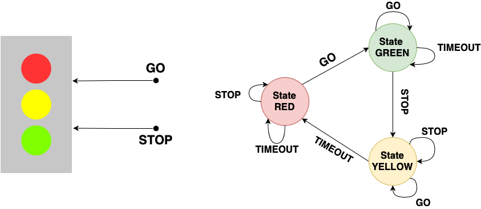

# State machines - Traffic Light Example 

This is an example application illustrating the use of the **state machine** implementation pattern for the course **1DT106 Programming Embedded Systems** at Uppsala University. 

## Introduction 

The goal is to implement a state machine that mimics the behaviour of a simple traffic light system. The system has two external inputs, a STOP and GO signal. The following diagram illustrates the three different states of the system and the triggers that lead to state changes:



This example is taken from the following book: 

*White. (2012). Making embedded systems (First edition.). O’Reilly.*

## Implementation 

There are three different implementations that build upon each other: 

- Simple (state centric, no debouncing)
- Queue (active debouncing, interrupts, queue between ISR and main)
- Table driven (using a state table) 

All three implementations are written for the Raspberry Pi Pico board and assume that a red, yellow, and green LED are connected to gpio pin 0, 1, and 2 respectively. 

## Building 

You can build all three examples by issuing the following commands on a terminal: 

```bash
mkdir build
cd build
cmake .. 
make 
``` 

If the build fails, double check if you have installed the Pico C/C++ SDK correctly and have set the `PICO_SDK_PATH` environment variable to point to this installation! 

## License 

MIT 
